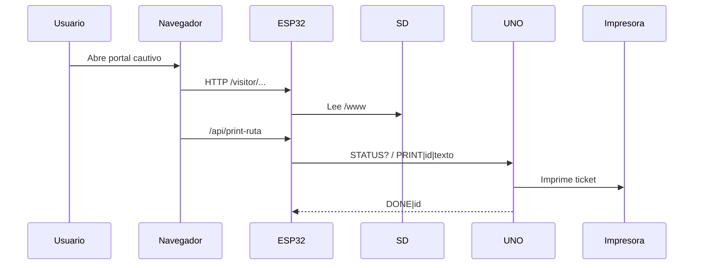

# Backend (UNO y ESP32) – Firmware y configuración

Este README documenta el firmware del backend y sus ajustes clave. Está enfocado en qué microcontrolador carga cada sketch, pines usados y parámetros configurables (credenciales, PDF, etc.).

## Qué se carga y dónde

- ESP32‑S3: [HexaTour (ESP32)/HexaTour.ino](Backend%20(UNO%20y%20ESP32)/HexaTour%20(ESP32)/HexaTour.ino)
- Arduino UNO: [Impresora (UNO)/ImpresoraUNO.ino](Backend%20(UNO%20y%20ESP32)/Impresora%20(UNO)/ImpresoraUNO.ino)

## Pines usados

### ESP32 (HexaTour.ino)
- SD (SPI):
  - SCK: GPIO 12
  - MISO: GPIO 13
  - MOSI: GPIO 11
  - CS: GPIO 10
- LCD I2C:
  - SDA: GPIO 8
  - SCL: GPIO 9
- UART con UNO (Serial2):
  - ESP32 RX2: GPIO 16 (desde UNO TX 11 con divisor)
  - ESP32 TX2: GPIO 17 (hacia UNO RX 10)

### Arduino UNO (ImpresoraUNO.ino)
- Enlace con ESP32 (SoftwareSerial):
  - UNO RX: 10 (desde ESP32 TX2)
  - UNO TX: 11 (hacia ESP32 RX2)
- Impresora térmica (SoftwareSerial):
  - UNO RX: 2 (desde TX impresora)
  - UNO TX: 3 (hacia RX impresora)

## Flujo general (backend)

1. El ESP32-S3 levanta un AP Wi-Fi, DNS cautivo y el servidor HTTP.
2. El portal cautivo lee archivos desde la SD (/www) y expone endpoints de impresion y PDF.
3. El ESP32 consulta estado del UNO y le envia trabajos de impresion por Serial2.
4. El UNO imprime en la termica y confirma con DONE cuando termina.

## Ajustes clave en el ESP32

### Wi‑Fi AP
En [Backend (UNO y ESP32)/HexaTour (ESP32)/HexaTour.ino](Backend%20(UNO%20y%20ESP32)/HexaTour%20(ESP32)/HexaTour.ino):

- SSID: `AP_SSID`
- Password: `AP_PASS`

### Credenciales del panel operador
En el mismo archivo:

- Usuario: `MAIN_USER`
- Contraseña: `MAIN_PASS`

### Página inicial del portal
- Variable `START_FILE` (por defecto /www/visitor/index.html).

### Logo en PDF de ruta
El PDF intenta incluir un logo si existe:

- Ruta esperada (JPEG): /www/img/map/logo.jpg
- Función: `findLogoJpeg()`

El archivo `logo.jpg` se usa exclusivamente en el PDF de ruta generado por el ESP32.

El archivo `logoHexaTour.png` se usa en el frontend como logo principal del portal.

### Endpoints relevantes
- `/api/print-ruta?cat=<categoria>&slug=<slug>&name=<nombre>` imprime rutas desde /www/db.
- `/api/route-pdf?cat=<categoria>&slug=<slug>&name=<nombre>&dl=1` genera PDF con texto e imagen desde /www/db.

### Detalle de endpoints

`GET /api/print-ruta`
- Query params: `cat`, `slug`, `name`, `file`.
- `cat` y `slug` se usan para cargar `/www/db/poi/<cat>/<slug>.json`.
- `name` solo se usa para el titulo impreso.
- `file` acepta el formato `<cat>/<slug>` y se usa como ref auxiliar.
- Respuesta: 200 si el trabajo fue encolado, 4xx si faltan datos.

`GET /api/route-pdf`
- Query params: `cat`, `slug`, `name`, `file`, `dl`.
- Si `dl=1`, fuerza descarga del PDF.
- El PDF incluye texto de ruta (`route.text`) e imagen de ruta si existe.

### Dependencias

- ArduinoJson (para leer /www/db/poi/<categoria>/<slug>.json).
- LiquidCrystal_I2C (LCD 16x2).
- Adafruit_Thermal (impresora termica en UNO).

## Librerias locales

El proyecto usa librerias locales en [Backend (UNO y ESP32)/librerias](Backend%20(UNO%20y%20ESP32)/librerias) para evitar depender del gestor del IDE. Los includes se ajustaron a rutas relativas.

Librerias utilizadas:
- ArduinoJson
- LiquidCrystal_I2C
- Adafruit_Thermal_Printer_Library

### Detalle de librerias

- ArduinoJson: lectura de la base JSON desde la SD en el ESP32-S3.
- LiquidCrystal_I2C: control de la pantalla LCD 16x2 por I2C.
- Adafruit_Thermal_Printer_Library: impresion en la termica desde el UNO.
- WiFi/WebServer/DNSServer: portal cautivo y API HTTP (core del ESP32).
- SPI/SD: acceso a la tarjeta SD (core del ESP32/Arduino).
- Wire: bus I2C para LCD (core del ESP32/Arduino).
- SoftwareSerial: UART por software en el UNO para impresora y enlace con ESP32.

## Formato de datos (POI)

El ESP32 espera una ficha JSON por POI en:

`/www/db/poi/<categoria>/<slug>.json`

Campos usados por el firmware:
- `name`: nombre visible del lugar.
- `fields`: `descripcion`, `tpie`, `tveh`, `apertura`, `cierre`, `alertas`.
- `route.text`: texto de indicaciones que se imprime y se incluye en PDF.
- `images.route` (opcional): ruta a la imagen de ruta; si falta se usa `img/<cat>/ruta<slug>.jpg`.

## Protocolo serial ESP32 <-> UNO

El ESP32 controla la impresora via UNO con mensajes de una linea (terminadas en `\n`):

- `STATUS?` (ESP32 -> UNO): solicita disponibilidad.
- `STATUS|<0|1>` (UNO -> ESP32): 1 disponible, 0 ocupado.
- `PRINT|<jobId>|<texto>` (ESP32 -> UNO): orden de impresion.
- `DONE|<jobId>` (UNO -> ESP32): confirma impresion finalizada.

Notas:
- El texto de impresion usa `\n` como salto de linea.
- El UNO ignora un `PRINT` si esta ocupado o si el `jobId` es repetido.

## Creditos y terceros

Librerias locales (se conservan sus licencias en cada carpeta):

- ArduinoJson: autor Benoit Blanchon, licencia MIT. Origen: https://github.com/bblanchon/ArduinoJson
- LiquidCrystal_I2C: autor Martin Kubovcik, licencia MIT. Origen: https://github.com/markub3327/LiquidCrystal_I2C
- Adafruit_Thermal_Printer_Library: autora Limor Fried (Ladyada) y Adafruit Industries, licencia MIT. Origen: https://github.com/adafruit/Adafruit-Thermal-Printer-Library

Cores y headers del toolchain (no pertenecen al proyecto):

- Arduino AVR core (UNO): SoftwareSerial, Wire, SPI, SD y otros headers del core oficial de Arduino.
- Arduino-ESP32 core (ESP32-S3): WiFi, WebServer, DNSServer, SPI, SD, Wire y otros headers del core oficial de Espressif.

## Ajustes clave en el UNO

- Puerto de la impresora térmica y velocidad:
  - `SoftwareSerial mySerial(PRINTER_RX, PRINTER_TX)`
  - `mySerial.begin(9600)`

- Mensaje final del ticket:
  - `GRACIAS POR USAR HEXATOUR`

- Descuento dinamico:
  - Calculado en el ESP32-S3 segun categoria y enviado al UNO para impresion.

## Contenidos en SD

La SD debe contener la carpeta www del frontend, incluyendo /www/db y /www/img. Ver guía de contenidos en [Frontend (Interfaz)/README.md](../Frontend%20(Interfaz)/README.md).

## Notas de compatibilidad

- Si cambias pines en el hardware, actualiza los `#define` correspondientes.
- Si cambias el logo del PDF, reemplaza el archivo en /www/img/map/logo.jpg (JPEG).

## Errores comunes (firmware y hardware)

- ESP32 no monta SD: revisar FAT32, cableado SPI y que exista /www en la tarjeta.
- Datos no cargan en portal: confirmar /www/db/index.json y que los slugs coincidan.
- Serial entre ESP32 y UNO no responde: verificar divisor en RX2, GND comun y baudrate.
- Impresora no imprime: confirmar 9V independiente, GND comun y pins RX/TX correctos.
- LCD no muestra texto: revisar direccion I2C y cableado SDA/SCL.
