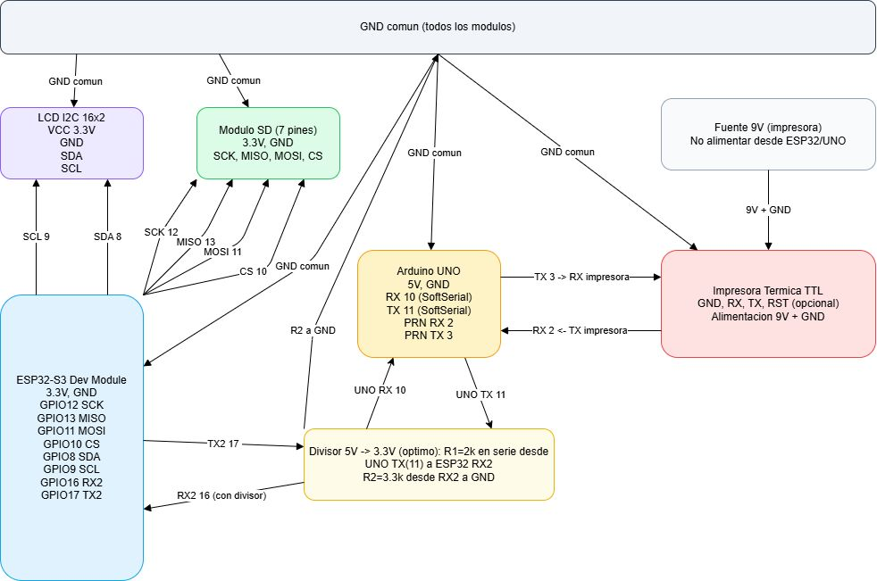

# HexaTour

Prototipo de orientacion turistica rural que funciona **sin Internet**. Ofrece un
portal cautivo con informacion de puntos de interes (POI) y permite imprimir
indicaciones mediante una impresora termica. El sistema se basa en ESP32-S3
(portal, SD, PDF) y Arduino UNO (control de impresora).

Video promocional: https://www.youtube.com/shorts/Zw-bziu8veU

## Estado del proyecto

**Proyecto de curso cerrado.** Este repositorio corresponde al prototipo
desarrollado para el curso **"Proyecto: Diseño e Innovación"** de la
Escuela de Ingeniería del Campus Guayacán de Coquimbo (UCN), que cursan
estudiantes de Ingeniería Civil Industrial (3er semestre) e Ingeniería
Civil en Computación e Informática (4to semestre).

El curso es la base experimental de la organización de proyectos de la
carrera: se avanza por fases (identificar y validar la problemática con
sustancia real, proponer soluciones y priorizarlas, implementar con
tecnologías como Arduino y ESP32, y defender la solución ante un jurado con
demostración y análisis de costos y rentabilidad). No se espera desarrollo
continuo: el código, la documentación y los datos quedan ordenados y
reproducibles para consulta o continuación.

## Tabla de contenidos

- [Vision general](#vision-general)
- [Como ejecutarlo desde cero](#como-ejecutarlo-desde-cero)
- [Estructura del repositorio](#estructura-del-repositorio)
- [Documentacion tecnica](#documentacion-tecnica)
- [Pruebas](#pruebas)
- [FAQ](#faq)
- [Creditos y terceros](#creditos-y-terceros)

## Vision general

- **Portal cautivo** con interfaz de visitante y de operador (sitio estatico en `web/www`).
- **Datos** en JSON dentro de la SD (`web/www/db`): categorias y POIs con ruta e imagenes.
- **Impresion** de rutas via impresora termica controlada por Arduino UNO.
- **Sin Internet**: el ESP32-S3 genera su propia red Wi-Fi y sirve el portal.

## Como ejecutarlo desde cero

No necesitas el hardware para revisar la interfaz ni para validar los datos.

### 1. Prerrequisitos

- **Python 3** (para servir la web y correr las pruebas). Cualquier version 3.8+.
- **Arduino IDE** o PlatformIO (solo si vas a cargar el firmware al ESP32-S3 / UNO).

### 2. Ver la web sin hardware

Desde la raiz de `HexaTour/`:

```bash
python tools/backend-local/server.py --root web/www --port 8000
```

Luego abre en el navegador:

- Visitante: http://localhost:8000/visitor/
- Operador:  http://localhost:8000/main/

Esto sirve los archivos de `web/www` y expone endpoints locales mock basados
en los JSON de la SD. Ver detalle en
[tools/backend-local/README.md](tools/backend-local/README.md).

### 3. Cargar el firmware (requiere hardware)

- ESP32-S3: abre [firmware/esp32/HexaTour.ino](firmware/esp32/HexaTour.ino) en el Arduino IDE.
- Arduino UNO: abre [firmware/uno/ImpresoraUNO.ino](firmware/uno/ImpresoraUNO.ino).
- Copia la carpeta `web/www` a la raiz de la tarjeta SD.
- Enciende el equipo, conectate a la red Wi-Fi `HexaTour` y abre:
  - Visitante: http://192.168.4.1/visitor/
  - Operador:  http://192.168.4.1/main/

Pines y librerias vendor: ver [firmware/README.md](firmware/README.md).

### 4. Diagrama de conexion



## Estructura del repositorio

- `docs/` — documentacion tecnica y entregables academicos (informes y anexos).
  - `docs/diagramas/` — diagramas del sistema y conexionado.
  - `docs/informes/` — informes y anexos del proyecto.
  - `docs/manual-proveedor.md` — guia operativa para el equipo tecnico.
- `firmware/` — sketches, pines y librerias locales para ESP32-S3 y UNO.
- `web/` — portal cautivo, base JSON y assets para la SD.
  - `web/www/` — sitio estatico servido por el ESP32 y por el backend local.
- `tools/backend-local/` — servidor mock para probar la web sin hardware.
- `test/` — validacion de la coherencia de los datos.

## Documentacion tecnica

- Manual del proveedor: [docs/manual-proveedor.md](docs/manual-proveedor.md)
- Firmware y pines: [firmware/README.md](firmware/README.md)
- Contenidos y portal cautivo: [web/README.md](web/README.md)
- Backend local (mock): [tools/backend-local/README.md](tools/backend-local/README.md)

## Pruebas

### Validacion de datos (sin servidor)

Verifica que los JSON de `web/www/db` tengan los campos obligatorios y que
los conteos de cada categoria coincidan:

```bash
python test/validate_data.py
```

Debe terminar con `[ok] Todos los datos son coherentes.` (codigo de salida 0).

### Smoke test de la web (requiere el servidor corriendo)

En una terminal deja corriendo el servidor del paso 2, y en otra:

```bash
python tools/backend-local/smoke_test.py --base http://localhost:8000
```

Valida el estado del servidor, el listado de categorias, un POI real y los
endpoints de impresion/PDF.

## FAQ

**El portal se ve lento**
- Los archivos `.gz` son variantes comprimidas **opcionales** (optimizacion de
  velocidad). El portal funciona sin ellos, solo mas lento. Estan ignorados en
  `.gitignore`, asi que un clon nuevo no los trae.
- Para generarlos (opcional, mejora la velocidad en el dispositivo real),
  desde la raiz de `HexaTour/`:
  ```bash
  python - <<'PY'
  import gzip, pathlib, shutil
  root = pathlib.Path("web/www")
  for p in root.rglob("*"):
      if p.is_file() and p.suffix != ".gz":
          with p.open("rb") as src, gzip.open(str(p) + ".gz", "wb") as dst:
              shutil.copyfileobj(src, dst)
  print("listo")
  PY
  ```
- Limpia la cache del navegador.

**No aparecen datos**
- Confirma que exista [web/www/db/index.json](web/www/db/index.json) y limpia cache.

**No imprime**
- Revisa el papel, la alimentacion de la impresora y el enlace serial con el UNO.

## Creditos y terceros

El proyecto usa componentes de terceros; cada uno conserva su licencia en su
carpeta.

### Librerias embebidas en `firmware/librerias`
- [ArduinoJson](https://github.com/bblanchon/ArduinoJson) — MIT (Benoit
  BLANCHON). Licencia:
  [firmware/librerias/ArduinoJson/LICENSE.txt](firmware/librerias/ArduinoJson/LICENSE.txt)
- [LiquidCrystal_I2C](https://github.com/markub3327/LiquidCrystal_I2C) — MIT
  (Martin Kubovcik, orig. Frank de Brabander). Licencia:
  [firmware/librerias/LiquidCrystal_I2C/LICENSE](firmware/librerias/LiquidCrystal_I2C/LICENSE)
- [Adafruit Thermal Printer Library](https://github.com/adafruit/Adafruit-Thermal-Printer-Library)
  — MIT (Adafruit Industries, Limor Fried). Licencia:
  [firmware/librerias/Adafruit_Thermal_Printer_Library/LICENSE](firmware/librerias/Adafruit_Thermal_Printer_Library/LICENSE)

Detalle de pines y dependencias: [firmware/README.md](firmware/README.md).

### Cores de Arduino (no embebidos, se instalan con el IDE)
- Core AVR (UNO): SoftwareSerial, Wire, SPI, SD y otros headers del core
  oficial de Arduino.
- Core ESP32 (ESP32-S3): WiFi, WebServer, DNSServer, SPI, SD, Wire y otros
  headers del core oficial de Espressif.

Licencia del proyecto: [LICENSE](LICENSE) (MIT).
