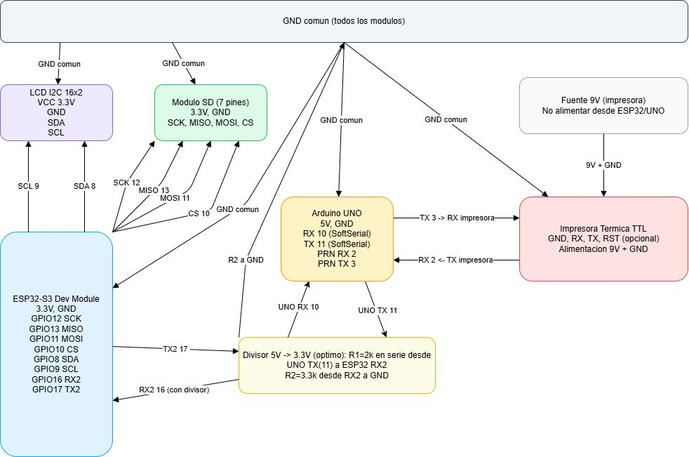

# HexaTour

Prototipo de orientacion turistica rural que funciona sin Internet. Ofrece un portal cautivo con informacion de puntos de interes y permite imprimir indicaciones mediante una impresora termica. El sistema se basa en ESP32-S3 (portal, SD, PDF) y Arduino UNO (control de impresora).

Video promocional: https://www.youtube.com/shorts/Zw-bziu8veU

## Estado de la entrega

Prototipo de curso cerrado. La interfaz puede probarse sin hardware con el mock Python; el portal cautivo y la impresion real requieren el montaje. No hay una demo publica validada documentada. La compilacion del firmware y las versiones de cores Arduino aun deben registrarse para una reproduccion completa.

## Tabla de contenidos

- [Vision general](#vision-general)
- [Guia rapida](#guia-rapida)
- [Documentacion clave](#documentacion-clave)
- [Mapa del repo](#mapa-del-repo)
- [Pruebas locales](#pruebas-locales)
- [FAQ](#faq)
- [Creditos y terceros](#creditos-y-terceros)

## Vision general

- Portal cautivo con UI de visitante y operador.
- Base de datos JSON y assets en la SD.
- Impresion de rutas via impresora termica.

El visitante consulta lugares y descarga PDF; el operador solicita impresion. [Contratos y limites de cada vista](web/README.md#paginas-del-portal).

## Guia rapida

### Sin hardware

Requiere Python 3.10 o posterior; la prueba local se ha ejecutado con Python 3.12.14. Ejecuta desde la raiz del repositorio, la carpeta que contiene este README, `firmware/`, `web/` y `tools/`:

```bash
python tools/backend-local/server.py --root web/www --port 8000
```

Abre http://localhost:8000/visitor/ y http://localhost:8000/main/. El mock simula aceptacion de impresion y genera un PDF sencillo; no se comunica con una ticketera ni reproduce la autenticacion del operador. Conserva `--root web/www`: la ruta predeterminada del servidor actual no apunta al contenido correcto. [Detalle del mock](tools/backend-local/README.md).

### Demo en servidor estático

Para explorar sin API ni hardware, desde la misma raíz:

```bash
python -m http.server 8000 --bind 127.0.0.1 --directory web/www
```

Abre http://localhost:8000/?demo=1. El aviso Demo sin hardware identifica la simulación: impresión local, PDF no disponible y urgencias sin envío. [Activación, recorrido y límites](docs/Demo.md). Las URLs sin `demo=1` mantienen el modo habitual.

Para distribuir una copia que siempre active demo, ejecuta `python tools/build_demo.py`. Genera `dist/demo` sin modificar el portal fuente; el [workflow manual y la guía de despliegue](docs/Despliegue.md) usan únicamente ese artefacto. La publicación pública sigue pendiente.

### Con hardware

Necesitas ESP32-S3, Arduino UNO, SD y los perifericos del circuito; Arduino IDE con soporte para ambas placas y las librerias descritas en [firmware/README.md](firmware/README.md).

1. Carga los sketches:
   - ESP32: [firmware/esp32/HexaTour.ino](firmware/esp32/HexaTour.ino)
   - UNO: [firmware/uno/ImpresoraUNO.ino](firmware/uno/ImpresoraUNO.ino)
2. Copia la carpeta `www` completa desde [web/www](web/www) a la raiz de la SD. Debe quedar `/www/visitor/index.html` y `/www/db/index.json`, conservando tambien `assets/`, `main/` e `img/` dentro de `/www`.
3. Enciende el equipo y conecta al Wi-Fi HexaTour.
4. Abre el portal:
   - Visitante: http://192.168.4.1/visitor/
   - Operador: http://192.168.4.1/main/



## Documentacion clave

- Indice tecnico y antecedentes academicos: [docs/README.md](docs/README.md)
- Demo sin hardware: [docs/Demo.md](docs/Demo.md)
- Componentes, flujos y limites: [docs/Arquitectura.md](docs/Arquitectura.md)
- Categorias, POI e imagenes: [docs/Formato-de-datos.md](docs/Formato-de-datos.md)
- Manual del proveedor: [docs/manual-proveedor.md](docs/manual-proveedor.md)
- Firmware y pines: [firmware/README.md](firmware/README.md)
- Contenidos y portal cautivo: [web/README.md](web/README.md)
- Backend local (mock): [tools/backend-local/README.md](tools/backend-local/README.md)

## Mapa del repo

- [docs](docs/README.md): indice de documentacion tecnica y antecedentes.
- [docs/diagramas](docs/diagramas): diagramas del sistema y conexionado.
- [docs/informes](docs/informes): informes y anexos del proyecto.
- [docs/manual-proveedor.md](docs/manual-proveedor.md): guia operativa para equipo tecnico.
- [firmware](firmware): sketches, pines y librerias locales para ESP32 y UNO.
- [web](web): portal cautivo, base JSON y assets para la SD.
- [tools/backend-local](tools/backend-local): servidor mock para pruebas locales.

## Pruebas locales

Desde la raiz del repositorio, con Python 3.10 o posterior, valida todo el catalogo sin iniciar un servidor:

```bash
python test/validate_data.py
python -m unittest discover -s test -p "test_*.py"
```

El [validador de datos](test/validate_data.py) cruza catalogo, listas y fichas, comprueba los recursos de imagen declarados y devuelve codigo 1 si hay inconsistencias. Las [regresiones](test/test_validate_data.py) usan datos temporales y no alteran el contenido de la web. No requieren paquetes externos. [Contrato, opciones y limites](docs/Formato-de-datos.md#validación-local).

Con el servidor del paso anterior en ejecucion, abre otra terminal desde la raiz del repositorio:

```bash
python tools/backend-local/smoke_test.py --base http://localhost:8000
```

El smoke debe terminar con codigo 0 y tres resultados `[ok]`: health, categories/poi y print/pdf. Comprueba API mock y un POI de ejemplo; no acredita todas las fichas, interaccion visual, portal cautivo, impresora o una publicacion estatica. [Guia del backend local](tools/backend-local/README.md).

## FAQ

**El portal se ve lento**
- Limpia cache y verifica los recursos originales en [web/www/db](web/www/db) y [web/www/img](web/www/img). El firmware actual sirve archivos sin comprimir; los `.gz` son opcionales y no deben reemplazar los originales.

**No aparecen datos**
- Confirma que exista [web/www/db/index.json](web/www/db/index.json) y limpia cache.

**No imprime**
- Revisa papel, alimentacion de la impresora y enlace serial con el UNO.

## Creditos y terceros

El proyecto incluye componentes de terceros. Se mantienen sus licencias en las carpetas correspondientes.

Esta rama no contiene una licencia raiz para el proyecto; las licencias de terceros se consultan en sus carpetas y no sustituyen esa definicion.

- Librerias y cores: ver detalle en [firmware/README.md](firmware/README.md).
- Arduino core para AVR (UNO): SoftwareSerial, Wire, SPI, SD y otros headers provienen del core oficial de Arduino.
- Arduino core para ESP32 (ESP32-S3): WiFi, WebServer, DNSServer, SPI, SD, Wire y otros headers provienen del core oficial de Espressif.
