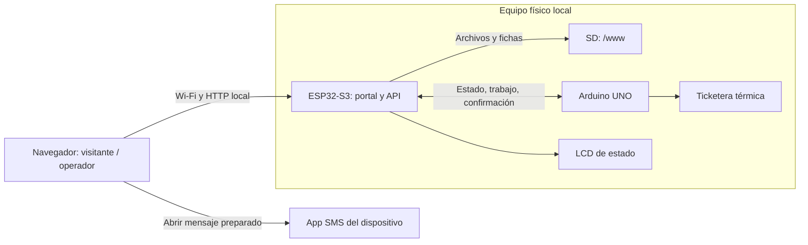
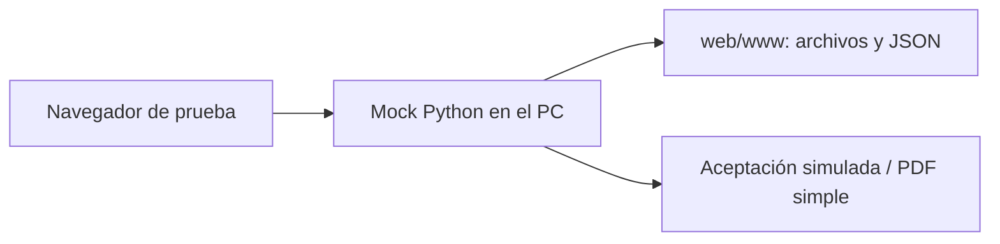
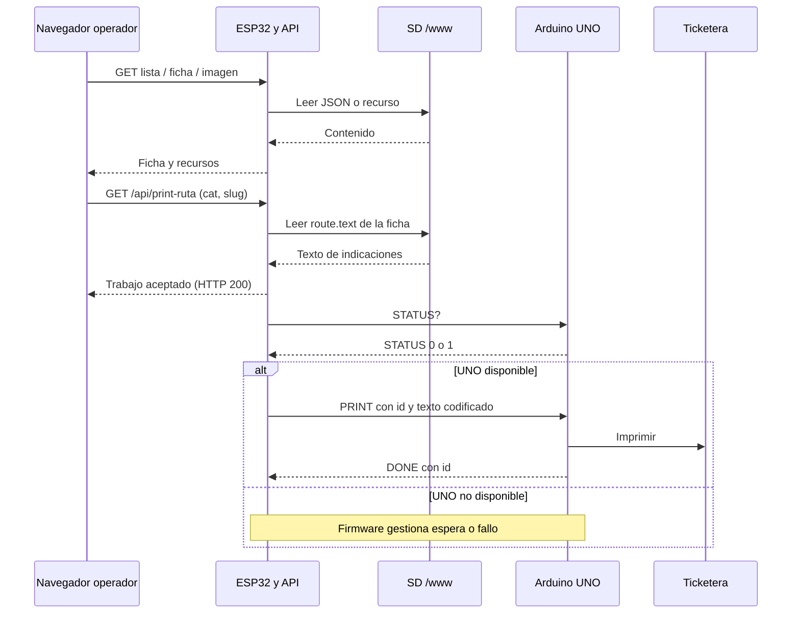
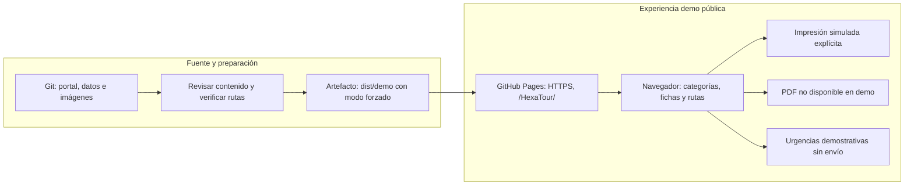
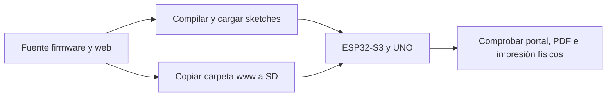

# Arquitectura de HexaTour

[Índice técnico](README.md) · [Ejecución y pruebas](../README.md#guia-rapida) · [Formato de datos](Formato-de-datos.md)

## Contexto y modos de ejecución

El montaje crea una red Wi-Fi local para consultar información sin Internet. El ESP32-S3 sirve el portal y las fichas desde la SD, genera PDF y coordina los trabajos de impresión; el Arduino UNO controla la ticketera. El navegador ejecuta HTML, CSS y JavaScript sin framework ni proceso de build.

| Componente | Responsabilidad | Fuente |
| --- | --- | --- |
| Portal web | Categorías, fichas, imágenes y solicitudes de acciones | [web/www](../web/www) |
| Cliente de contenidos | Leer listas y POI; resolver imágenes y campos | [common.js](../web/www/assets/js/common.js) |
| ESP32-S3 | Wi-Fi AP, DNS cautivo, HTTP, lectura SD, PDF y coordinación serial | [HexaTour.ino](../firmware/esp32/HexaTour/HexaTour.ino) |
| SD | HTML/CSS/JS, JSON e imágenes bajo `/www` | [Contenido para SD](../web/www) |
| Arduino UNO | Estado de disponibilidad, impresión y confirmación final | [ImpresoraUNO.ino](../firmware/uno/ImpresoraUNO/ImpresoraUNO.ino) |
| Mock Python | Servir archivos locales y simular API para pruebas | [server.py](../tools/backend-local/server.py) |

Vista del montaje implementado; los pines y voltajes se consultan en la [guía de firmware](../firmware/README.md) y el [circuito](diagramas/HexaTourCircuito.drawio).

La acción SMS requiere configuración local de destinatario y punto, además de la aplicación y capacidad de mensajería del dispositivo cliente; la red local del ESP32 no envía mensajes por sí misma. Los valores vienen vacíos por defecto.

## Prueba local y alojamiento estático

El mock sirve la misma carpeta web desde un PC y responde a solicitudes de impresión con una aceptación simulada. Produce un PDF de texto simple para la prueba; no reproduce necesariamente las imágenes ni la composición del PDF del firmware. Tampoco reproduce autenticación del operador, DNS cautivo, LCD, comunicación serial o impresión física.

Un hosting que sirve sólo `web/www` permite leer archivos estáticos, pero no implementa `/api/print-ruta` ni `/api/route-pdf`. El [modo demo](Demo.md) se activa con `demo=1`: sustituye impresión por un mensaje local, deshabilita PDF e impide apertura de SMS. La landing y los enlaces de demo derivan la raíz del sitio desde common.js, conservando una base como `/HexaTour/`. Sin ese parámetro continúa el modo habitual; antes de publicar hay que definir las entradas del artefacto y comprobar el hosting real.

## Navegación y lectura de datos

1. El ESP32 envía la entrada `/` a la página visitante; el mock sirve la landing estática, que abre `/visitor/`.
2. Los botones de categoría de cada HTML conducen a `lugar.html?cat=<etiqueta>` dentro de su propia vista.
3. `common.js` convierte etiquetas como `Ríos` o `Ferias Artesanales` en carpetas `rios` o `ferias`.
4. El navegador carga `db/categories/<categoria>.json` y luego `db/poi/<categoria>/<slug>.json`. Prueba primero rutas relativas y después otras bases como `/db` y `/www/db`.
5. La ficha completa los campos y la imagen principal. El botón de ruta muestra una imagen; imprimir o descargar PDF usa la API.

`db/index.json` registra el catálogo y sus conteos, pero los botones actuales de la interfaz están escritos en HTML. Agregar una categoría al índice no agrega automáticamente un botón. Véase [Formato de datos](Formato-de-datos.md#coherencia-al-editar).

## Acciones por vista en la implementación actual

| Vista / acción | Resultado real | Fuente |
| --- | --- | --- |
| Visitante: descargar indicaciones | Navegación a `/api/route-pdf` con `dl=1` | [visitor-lugar.js](../web/www/assets/js/visitor-lugar.js) |
| Operador: imprimir indicaciones | Solicitud a `/api/print-ruta` | [main-lugar.js](../web/www/assets/js/main-lugar.js) |
| Ambas: ver ruta | Carga de `images.route` o ruta de imagen convencional | Los dos scripts de ficha |
| Visitante: urgencia | Sin configuración muestra SMS no configurado; con destinatario y punto válidos, tras confirmar abre SMS preparado; el usuario debe enviarlo desde su app | visitor-lugar.js |
| Operador: urgencia | Tras confirmar, muestra mensaje local; no realiza llamada ni envío | main-lugar.js |

Esta tabla y la [guía web](../web/README.md#paginas-del-portal) describen las acciones del modo habitual. El operador confirma un aviso local y su resultado aclara que no se realizó llamada ni envío. En visitante, abrir la app de mensajes tampoco confirma envío ni recepción; el destinatario y punto vienen vacíos y requieren configuración local. En demo, ambas vistas de urgencia muestran sólo mensajes locales sin abrir esa app.

El firmware solicita autenticación HTTP Basic para servir `/main/`. El mock no aplica ese control. No debe suponerse que la autenticación de la vista protege toda la API: los handlers de impresión/PDF no invocan ese control.

## Impresión y PDF

La referencia de un POI se envía mediante `cat` y `slug`; existe también `file=<categoria>/<slug>` como alternativa. El ESP32 lee `name`, `route.text` e `images.route` de la ficha en `/www/db/poi`. Un `name` enviado por el cliente puede sustituir el título del documento o ticket.

Para impresión, el firmware rechaza otro trabajo mientras está ocupado, prepara texto, asigna un identificador y responde `print job accepted`. Esa respuesta confirma aceptación, no finalización. Después consulta `STATUS?`, recibe `STATUS|0` o `STATUS|1`, envía `PRINT|<id>|<texto>` y espera `DONE|<id>` del UNO. El UNO ignora trabajos ocupados o repetidos. El texto usa saltos codificados para conservar un mensaje serial por línea; se limita a 800 bytes y puede incluir un descuento generado por el firmware.

El PDF físico usa texto de ruta, imagen JPEG de ruta y logo JPEG cuando están disponibles. La salida y los límites de composición dependen del firmware; el smoke mock sólo comprueba que el endpoint devuelva contenido con cabecera PDF. [Protocolo y configuración](../firmware/README.md#protocolo-serial-esp32-uno).

### Flujo de datos y aceptación de impresión

Vista de la implementación física. Una respuesta HTTP de aceptación y una confirmación serial de finalización son eventos distintos; el navegador actual recibe la primera.

La descarga PDF utiliza el texto y las imágenes de la SD en el ESP32, sin pasar por UNO/ticketera. El mock sustituye los participantes físicos por respuestas de prueba; no confirma la secuencia serial.

## Demo disponible y distribución pública

El checkout activa demo explícitamente por URL; la copia generada por build_demo.py la fuerza mediante una marca en todas las entradas HTML. Se comprobó localmente y en la [demo pública de Pages](https://nicocg32.github.io/HexaTour/). El workflow manual publica sólo esa copia, sin ejecutar firmware, servidor Python o impresora. La modalidad elegida es PDF no disponible; impresión y urgencias son simulaciones locales. [Versión y guía de distribución](Despliegue.md).

El artefacto publicable se limita al contenido web revisado. Diagramas, informes, firmware y herramientas de desarrollo no son parte de esa raíz estática. El recorrido local no acredita una publicación ni la vigencia/autorización de todo el contenido. [Demo.md](Demo.md) distingue el checkout activado por parámetro y la copia pública que fuerza simulación independientemente de la URL.

Para el equipo físico, la distribución es distinta y conserva su propia frontera:

La SD debe contener `/www`; actualizar un sitio público no actualiza ese almacenamiento ni los sketches. La [compilación de ambos firmwares con versiones fijas](../firmware/Compilacion.md) está comprobada; la carga y prueba física siguen pendientes. La fuente editable del circuito permanece en [HexaTourCircuito.drawio](diagramas/HexaTourCircuito.drawio), con sus [vistas exportadas](README.md#circuito-y-fuentes-editables).

## Límites de la entrega

La verificación disponible cubre API mock, datos, demo pública y compilación/enlace de ambos firmwares, no funcionamiento del montaje completo. La base de compilación es nueva: no se conocen las versiones del entorno original. Las pruebas físicas están enumeradas en la [guía de compilación](../firmware/Compilacion.md#prueba-física-pendiente). El portal no calcula rutas geográficas en vivo; muestra texto e imágenes almacenados. Los tiempos, horarios, alertas y descuentos no constituyen información turística verificada por la prueba técnica.
