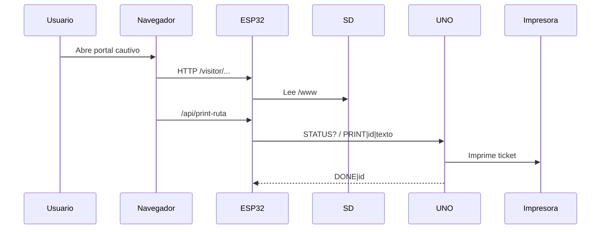

# Firmware - ESP32 y UNO

Este README documenta el firmware y sus ajustes clave. Incluye que microcontrolador carga cada sketch, pines usados y parametros configurables (credenciales, PDF, etc.).

## Tabla de contenidos

- [Guia rapida](#guia-rapida)
- [Que se carga y donde](#que-se-carga-y-donde)
- [Pines usados](#pines-usados)
- [Flujo general](#flujo-general)
- [Ajustes clave en ESP32](#ajustes-clave-en-esp32)
- [Protocolo serial ESP32-UNO](#protocolo-serial-esp32-uno)
- [Dependencias y librerias](#dependencias-y-librerias)
- [Errores comunes](#errores-comunes)

## Guia rapida

1. Abre el sketch del ESP32: [firmware/esp32/HexaTour.ino](firmware/esp32/HexaTour.ino)
2. Abre el sketch del UNO: [firmware/uno/ImpresoraUNO.ino](firmware/uno/ImpresoraUNO.ino)
3. Verifica pines, credenciales y rutas.
4. Carga ambos sketches en sus placas.

## Que se carga y donde

- ESP32-S3: [firmware/esp32/HexaTour.ino](firmware/esp32/HexaTour.ino)
- Arduino UNO: [firmware/uno/ImpresoraUNO.ino](firmware/uno/ImpresoraUNO.ino)

## Pines usados

### ESP32 (HexaTour.ino)
- SD (SPI):
  - SCK: GPIO 12
  - MISO: GPIO 13
  - MOSI: GPIO 11
  - CS: GPIO 10
- LCD I2C:
  - SDA: GPIO 8
  - SCL: GPIO 9
- UART con UNO (Serial2):
  - ESP32 RX2: GPIO 16 (desde UNO TX 11 con divisor)
  - ESP32 TX2: GPIO 17 (hacia UNO RX 10)

### Arduino UNO (ImpresoraUNO.ino)
- Enlace con ESP32 (SoftwareSerial):
  - UNO RX: 10 (desde ESP32 TX2)
  - UNO TX: 11 (hacia ESP32 RX2)
- Impresora termica (SoftwareSerial):
  - UNO RX: 2 (desde TX impresora)
  - UNO TX: 3 (hacia RX impresora)

## Flujo general

1. El ESP32-S3 levanta un AP Wi-Fi, DNS cautivo y el servidor HTTP.
2. El portal cautivo lee archivos desde la SD (carpeta [web/www](web/www)) y expone endpoints de impresion y PDF.
3. El ESP32 consulta estado del UNO y le envia trabajos de impresion por Serial2.
4. El UNO imprime en la termica y confirma con DONE cuando termina.

## Ajustes clave en ESP32

En [firmware/esp32/HexaTour.ino](firmware/esp32/HexaTour.ino):

- Wi-Fi AP: `AP_SSID`, `AP_PASS`
- Credenciales del panel operador: `MAIN_USER`, `MAIN_PASS`
- Pagina inicial del portal: `START_FILE`

Logo para PDF de ruta:
- Ruta esperada en SD: /www/img/map/logo.jpg
- Funcion: `findLogoJpeg()`

Endpoints relevantes:
- `/api/print-ruta?cat=<categoria>&slug=<slug>&name=<nombre>`
- `/api/route-pdf?cat=<categoria>&slug=<slug>&name=<nombre>&dl=1`

## Protocolo serial ESP32-UNO

Mensajes de una linea (terminadas en `\n`):

- `STATUS?` (ESP32 -> UNO): solicita disponibilidad.
- `STATUS|<0|1>` (UNO -> ESP32): 1 disponible, 0 ocupado.
- `PRINT|<jobId>|<texto>` (ESP32 -> UNO): orden de impresion.
- `DONE|<jobId>` (UNO -> ESP32): confirma impresion finalizada.

Notas:
- El texto de impresion usa `\n` como salto de linea.
- El UNO ignora un PRINT si esta ocupado o si el jobId es repetido.

## Dependencias y librerias

El proyecto usa librerias locales en [firmware/librerias](firmware/librerias) para evitar depender del gestor del IDE.

Librerias utilizadas:
- ArduinoJson
- LiquidCrystal_I2C
- Adafruit_Thermal_Printer_Library

## Errores comunes

- ESP32 no monta SD: revisar FAT32, cableado SPI y que exista [web/www](web/www) en la tarjeta.
- Datos no cargan en portal: confirmar [web/www/db/index.json](web/www/db/index.json) y que los slugs coincidan.
- Serial entre ESP32 y UNO no responde: verificar divisor en RX2, GND comun y baudrate.
- Impresora no imprime: confirmar 9V independiente, GND comun y pins RX/TX correctos.
- LCD no muestra texto: revisar direccion I2C y cableado SDA/SCL.
