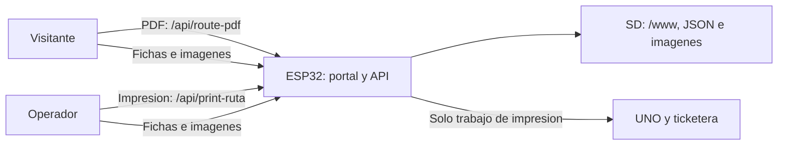

# Web - Gestion de contenidos

Este README describe como actualizar el contenido que consume el portal cautivo de HexaTour. El foco esta en la base de datos JSON y los assets dentro de [web/www](www).

> Importante
> - Todo en UTF-8 sin BOM.
> - No alteres la estructura de carpetas.
> - Los nombres de archivo deben coincidir con el slug.

Referencia del formato y coherencia entre catálogo, listas, fichas e imágenes: [Formato de datos](../docs/Formato-de-datos.md). Los componentes y acciones de la implementación actual están descritos en [Arquitectura](../docs/Arquitectura.md).

## Tabla de contenidos

- [Guia rapida](#guia-rapida)
- [Estructura](#estructura)
- [Paginas del portal](#paginas-del-portal)
- [Flujo de datos](#flujo-de-datos)
- [JS principal](#js-principal)
- [Endpoints usados](#endpoints-usados)
- [Urgencias](#urgencias)
- [Modo demo](#modo-demo)
- [Actualizar contenidos](#actualizar-contenidos)
- [Compresion GZ](#compresion-gz)
- [Testeo local](#testeo-local)
- [FAQ](#faq)

## Guia rapida

1. Edita la base JSON y las imagenes en [web/www/db](www/db) y [web/www/img](www/img).
2. Si usas .gz, regeneralos (ver [Compresion GZ](#compresion-gz)).
3. Prueba en PC con el backend mock (ver [Testeo local](#testeo-local)).
4. Copia [web/www](www) a la SD.

## Estructura

```
www/
  db/
    index.json
    categories/
    poi/
  img/
```

Archivos clave:
- [web/www/db/index.json](www/db/index.json)
- [web/www/db/categories](www/db/categories)
- [web/www/db/poi](www/db/poi)

## Paginas del portal

- Visitante: [web/www/visitor/index.html](www/visitor/index.html) y [web/www/visitor/lugar.html](www/visitor/lugar.html)
- Operador: [web/www/main/index.html](www/main/index.html) y [web/www/main/lugar.html](www/main/lugar.html)
- Landing: [web/www/index.html](www/index.html)

| Vista | Indicaciones | Urgencias |
| --- | --- | --- |
| Visitante | Consulta lugares, muestra imagen de ruta y descarga PDF desde el servidor | Con SMS configurado, abre la app con destinatario y mensaje preparados; el envio lo realiza el usuario |
| Operador | Consulta lugares, muestra imagen de ruta y solicita impresion | Muestra un aviso local tras confirmar; no llama ni envia una alerta |

Estas acciones describen la implementacion actual. La [arquitectura](../docs/Arquitectura.md#acciones-por-vista-en-la-implementación-actual) distingue el montaje fisico del mock y del alojamiento estatico.

## Flujo de datos

1. El usuario elige una categoria.
2. Se carga la lista de categoria desde:

```
db/categories/<categoria>.json
```

3. Al seleccionar un item, se carga la ficha desde:

```
db/poi/<categoria>/<slug>.json
```
4. Se renderizan campos, imagen principal y ruta.
5. En operador, se puede solicitar impresion; en visitante, se puede descargar PDF. Ambas acciones requieren la API del servidor.



## JS principal

- Utilidades globales: [web/www/assets/js/common.js](www/assets/js/common.js)
- Visitante:
  - [web/www/assets/js/visitor-index.js](www/assets/js/visitor-index.js)
  - [web/www/assets/js/visitor-lugar.js](www/assets/js/visitor-lugar.js)
- Operador:
  - [web/www/assets/js/main-index.js](www/assets/js/main-index.js)
  - [web/www/assets/js/main-lugar.js](www/assets/js/main-lugar.js)
- Landing: [web/www/assets/js/landing.js](www/assets/js/landing.js)

## Endpoints usados

- `GET /api/print-ruta?cat=<categoria>&slug=<slug>&name=<nombre>&file=<cat/slug>`
  - Usado por [web/www/assets/js/main-lugar.js](www/assets/js/main-lugar.js) para solicitar impresion desde operador.
  - La respuesta de exito acredita aceptacion del trabajo; la finalizacion fisica se confirma por el protocolo ESP32-UNO. En el mock, la aceptacion es simulada.
- `GET /api/route-pdf?cat=<categoria>&slug=<slug>&name=<nombre>&file=<cat/slug>&dl=1`
  - Usado por [web/www/assets/js/visitor-lugar.js](www/assets/js/visitor-lugar.js) para descargar PDF desde visitante. El firmware genera el documento; el mock entrega un PDF de texto simple.

La imagen de ruta se lee de un archivo estatico y no necesita esos endpoints. Los botones de impresion/PDF aparecen o se habilitan cuando la ficha tiene `route.text` no vacio. Un alojamiento de archivos estaticos por si solo no implementa estas APIs.

## Urgencias

La opcion Urgencia se genera en la interfaz; no tiene fichas en el catalogo JSON actual.

- Visitante: `URGENCIA_SMS` en [visitor-lugar.js](www/assets/js/visitor-lugar.js) contiene `phone` y `punto`, vacios por defecto. Para un montaje local, configurar un destinatario acordado y un punto descriptivo; `phone` requiere formato internacional con `+` y entre 8 y 15 digitos. La validacion comprueba formato, no titularidad ni capacidad de atender urgencias. Sin configuracion valida muestra SMS no configurado; con ella, solicita confirmacion y abre la app con un mensaje preparado. Abrir la app no confirma envio ni recepcion. Conservar estos valores vacios en la distribucion publica.
- Operador: tras confirmar que desea un aviso local, lo muestra en la misma pagina, explicando que no ha realizado llamada ni envio. El comportamiento es exclusivamente local.

En modo demo, ambas vistas muestran mensajes locales sin abrir SMS, independientemente de la configuracion. La comprobacion del mock no valida SMS ni atencion de emergencias. [Limites y contratos](../docs/Arquitectura.md#acciones-por-vista-en-la-implementación-actual).

## Modo demo

Activar con `?demo=1` en la landing o en cualquiera de las vistas. Se conserva al navegar a categorias y volver, y aparece un aviso con enlaces Visitante/Operador. En este modo:

- Imprimir se presenta como **Simular impresión** y muestra un estado local sin solicitar API.
- Descargar PDF se presenta como **PDF no disponible en demo**, deshabilitado; la imagen de ruta funciona.
- Urgencia muestra demostraciones locales sin confirmacion de contacto ni apertura de SMS.

Sin ese parametro se mantienen los endpoints habituales. La raiz web se obtiene desde common.js para conservar una base como `/HexaTour/`. [Guia de ejecucion y limites de publicacion](../docs/Demo.md).

## Actualizar contenidos

### Actualizar un POI existente

1. Edita la ficha JSON del POI. Ruta esperada:

```
www/db/poi/<categoria>/<slug>.json
```

2. Si cambia el nombre visible, actualiza la lista de categoria:

```
www/db/categories/<categoria>.json
```

3. Si cambian imagenes, reemplaza archivos en:

```
www/img/<categoria>/
```

### Agregar un nuevo POI

1. Agrega el item en la lista de categoria:

```
www/db/categories/<categoria>.json
```

2. Crea la ficha del POI:

```
www/db/poi/<categoria>/<slug>.json
```

3. Actualiza el conteo en [web/www/db/index.json](www/db/index.json).
4. Agrega las imagenes requeridas en:

```
www/img/<categoria>/
```

### Logo del PDF

El PDF puede incluir un logo si existe en:
- [web/www/img/map/logo.jpg](www/img/map/logo.jpg)

El archivo [web/www/img/map/logoHexaTour.png](www/img/map/logoHexaTour.png) se usa como logo principal en el portal.

## Compresion GZ

Si usas archivos comprimidos en el ESP32, regenera los .gz despues de cambios en JSON o imagenes:

```powershell
Get-ChildItem -Path "web\www\db" -Filter *.gz -Recurse | Remove-Item -Force
Get-ChildItem -Path "web\www\img" -Filter *.gz -Recurse | Remove-Item -Force
Add-Type -AssemblyName System.IO.Compression.FileSystem
Get-ChildItem -Path "web\www\db" -Filter *.json -Recurse | ForEach-Object {
  $src = $_.FullName; $dst = $src + ".gz"
  $input=[IO.File]::OpenRead($src); $output=[IO.File]::Create($dst)
  $gzip=New-Object IO.Compression.GzipStream($output,[IO.Compression.CompressionMode]::Compress)
  $input.CopyTo($gzip); $gzip.Dispose(); $input.Dispose(); $output.Dispose()
}
$imgExt = @('*.jpg','*.jpeg','*.png','*.webp','*.svg')
foreach($ext in $imgExt){
  Get-ChildItem -Path "web\www\img" -Filter $ext -Recurse | ForEach-Object {
    $src = $_.FullName; $dst = $src + ".gz"
    $input=[IO.File]::OpenRead($src); $output=[IO.File]::Create($dst)
    $gzip=New-Object IO.Compression.GzipStream($output,[IO.Compression.CompressionMode]::Compress)
    $input.CopyTo($gzip); $gzip.Dispose(); $input.Dispose(); $output.Dispose()
  }
}
```

## Testeo local

Antes de servir el portal, desde la raiz del repositorio, ejecuta `python test/validate_data.py`. Cruza catalogo, listas, fichas y archivos de imagen de todas las categorias; termina con codigo 1 ante inconsistencias. Para las pruebas del propio validador: `python -m unittest discover -s test -p "test_*.py"`. [Opciones y limites](../docs/Formato-de-datos.md#validación-local).

Ejecuta los comandos desde la raiz del repositorio (la carpeta que contiene `README.md`, `firmware/`, `web/` y `tools/`), no desde `web/`. Requiere Python 3.10 o posterior por las anotaciones del servidor mock.

1. Inicia el backend local:
  - Python: python "tools/backend-local/server.py" --root "web/www" --port 8000
2. Abre en el navegador:
   - Visitante: http://localhost:8000/visitor/
   - Operador: http://localhost:8000/main/

Si no ves los cambios, limpia cache y recarga.

## FAQ

**No se ven los cambios**
- Limpia cache del navegador y verifica que los .gz esten regenerados.

**JSON invalido**
- Revisa comas finales y comillas faltantes en los archivos de categoria o POI.
